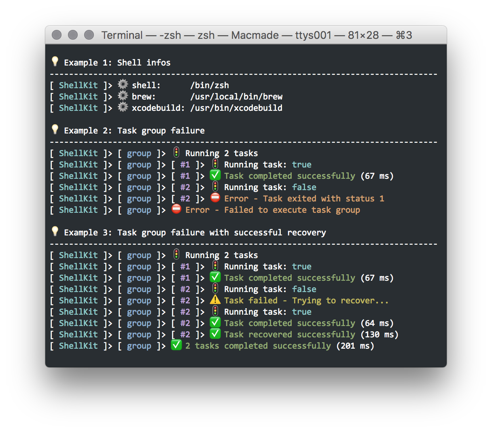

ShellKit
========

[](https://travis-ci.org/macmade/ShellKit)
[](https://coveralls.io/r/macmade/ShellKit?branch=master)
[](https://github.com/macmade/ShellKit/issues)


[](https://twitter.com/macmade)  
[](https://patreon.com/macmade)
[](https://www.gratipay.com/macmade)
[](https://paypal.me/xslabs)

About
-----

Objective-C framework for running shell scripts.



Code Examples
-------------

`ShellKit` provides a test executable.  
For complete examples, please take a look at the [source code](https://github.com/macmade/ShellKit/blob/master/ShellKit-Test/main.m).

### Shell informations

Various shell informations, like paths for commands, can be retrieved using the `SKShell` class:

```objc
[ [ SKShell currentShell ] commandIsAvailable: @"xcodebuild" ]

NSString * path = [ [ SKShell currentShell ] pathForCommand: @"xcodebuild" ]
```

### Running simple commands

Arbitrary shell commands can be run using the `SKShell` class.  
Note that commands are executed using the shell defined in the `SHELL` environment variable, invoked as a login shell.  
Data for `stdin` can be provided; `stdout` and `stderr` can be retrieved.

```objc
[ [ SKShell currentShell ] runCommand: @"ls -al"
                           completion: ^( int status, NSString * output, NSString * error )
    {
        NSLog( @"%i", status );
        NSLog( @"%@", output );
        NSLog( @"%@", error );
    }
];
```

### Running shell script tasks

A shell command can by run by using the `SKTask` object:

```objc
SKTask * task;

task = [ SKTask taskWithShellScript: @"ls -al" ];

[ task run ];
```

The task is run synchronously, and its output, if any, will be automatically printed to `stdout`.

The task will print the executed command prior to running, and print a status message once it's terminated, along with the elapsed time:

    [ ShellKit ]> 🚦  Running task: ls -al
    total 536
    drwxr-xr-x  5 macmade  staff     170 May 11 23:49 .
    drwxr-xr-x@ 4 macmade  staff     136 May 11 22:18 ..
    -rwxr-xr-x  1 macmade  staff  124624 May 11 23:49 ShellKit-Test
    drwxr-xr-x  7 macmade  staff     238 May 11 23:48 ShellKit.framework
    -rw-r--r--  1 macmade  staff  143936 May 11 23:48 libShellKit-Static.a
    [ ShellKit ]> ✅  Task completed successfully (63 ms)
    
A task can have sub-tasks, to try to recover from a failure:

```objc
SKTask * task;

task = [ SKTask taskWithShellScript: @"false" recoverTask: [ SKTask taskWithShellScript: @"true" ] ];

[ task run ];
```

Here, the `false` task will obviously fail, but it will then execute the `true` task, set as recovery.  
As `true` will succeed, the `false` task will also succeed:

    [ ShellKit ]> 🚦  Running task: false
    [ ShellKit ]> ⚠️  Task failed - Trying to recover...
    [ ShellKit ]> 🚦  Running task: true
    [ ShellKit ]> ✅  Task completed successfully (66 ms)
    [ ShellKit ]> ✅  Task recovered successfully (66 ms)

### Optional tasks

A task can be marked as optional by using the `SKOptionalTask`.  
In such a case, the task will succeed, regardless of its exit status:

```objc
SKOptionalTask * task;
            
task = [ SKOptionalTask taskWithShellScript: @"false" ];

[ task run ];
```

    [ ShellKit ]> 🚦  Running task: false
    [ ShellKit ]> ⛔️  Error - Task exited with status 1
    [ ShellKit ]> ✅  Task is marked as optional - Not failing

### Running task groups

Multiple tasks can be grouped in a `SKTaskGroup` object:

```objc
SKTask      * t1;
SKTask      * t2;
SKTaskGroup * group;

t1    = [ SKTask taskWithShellScript: @"true" ];
t2    = [ SKTask taskWithShellScript: @"true" ];
group = [ SKTaskGroup taskGroupWithName: @"task-group" tasks: @[ t1, t2 ] ];
        
[ group run ];
```

The group will try to run each task.  
If a task fails, the whole group will also fail.

    [ ShellKit ]> [ task-group ]> 🚦  Running 2 tasks
    [ ShellKit ]> [ task-group ]> [ #1 ]> 🚦  Running task: true
    [ ShellKit ]> [ task-group ]> [ #1 ]> ✅  Task completed successfully (64 ms)
    [ ShellKit ]> [ task-group ]> [ #2 ]> 🚦  Running task: true
    [ ShellKit ]> [ task-group ]> [ #2 ]> ✅  Task completed successfully (65 ms)
    [ ShellKit ]> [ task-group ]> ✅  2 tasks completed successfully (132 ms)

### Running task groups within task groups

A task group may also contain other task groups:

```objc
SKTask      * t1;
SKTask      * t2;
SKTaskGroup * g1;
SKTaskGroup * g2;

t1 = [ SKTask taskWithShellScript: @"true" ];
t2 = [ SKTask taskWithShellScript: @"true" ];
g1 = [ SKTaskGroup taskGroupWithName: @"child-group" tasks: @[ t1, t2 ] ];
g2 = [ SKTaskGroup taskGroupWithName: @"parent-group" tasks: @[ g1 ] ];
        
[ g2 run ];
```

The hierarchy of groups will be reflected by the prompt, like:

    [ ShellKit ]> [ parent-group ]> [ #1 ]> [ child-group ]> [ #1 ]> 🚦  Running task: true

**Note that task groups can also run custom classes, as long as they conform to the `SKRunableObject` protocol.**

### Variables substitution

A task may contain variables, that will be substituted when running.  
A variable has the following form:

    %{name}%

The variable name may contain letters from A to Z (uppercase or lowercase) and numbers from 0 to 9.

Variables are passed using the `run:` method of `SKTask` and `SKTaskGroup`.

```objc
SKTask * task;

task = [ SKTask taskWithShellScript: @"ls %{args}% %{dir}%" ];

[ task run: @{ @"args" : @"-al", @"dir" : @"/usr" } ];
```

In the example above, the executed script will be: `ls -al /usr`.

If no value is provided for a variable, the task will fail:

```objc
SKTask * task;

task = [ SKTask taskWithShellScript: @"echo %{hello}% %{foo}% %{bar}%" ];

[ task run: @{ @"hello" : @"hello, world" } ];
```

    [ ShellKit ]> 🚦  Running task: echo hello, world %{foo}% %{bar}%
    [ ShellKit ]> ⚠️  No value provided value for variable: foo
    [ ShellKit ]> ⚠️  No value provided value for variable: bar
    [ ShellKit ]> ⛔️  Error - Script contains unsubstituted variables

### Printing messages

Messages can be printed very easily.  
For this purpose, the `SKShell` class provides several methods, like the following one:


```objc
- ( void )printMessage: ( NSString * )format
          status:       ( SKStatus )status
          color:        ( SKColor )color,
                        ...;
```

The status represents an optional icon.  
Colors can also be used, if the terminal supports it.

As an example:

```objc
[ [ SKShell currentShell ] printMessage: @"hello, %@"
                           status:       SKStatusDebug
                           color:        SKColorCyan,
                                         @"world"
];
```

will produce:

    🚸 hello, world

### Customising prompt

The prompt can be customised to reflect the hierarchy of the invoked commands.

For instance:

```objc
[ SKShell currentShell ].promptParts = @[ @"foo", @"bar" ];
```

Then, every printed message will be prefixed by:

    [ foo ]> [ bar ]> ... message ...

License
-------

ShellKit is released under the terms of the MIT license.

Repository Infos
----------------

    Owner:          Jean-David Gadina - XS-Labs
    Web:            www.xs-labs.com
    Blog:           www.noxeos.com
    Twitter:        @macmade
    GitHub:         github.com/macmade
    LinkedIn:       ch.linkedin.com/in/macmade/
    StackOverflow:  stackoverflow.com/users/182676/macmade
